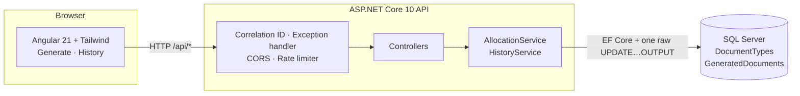
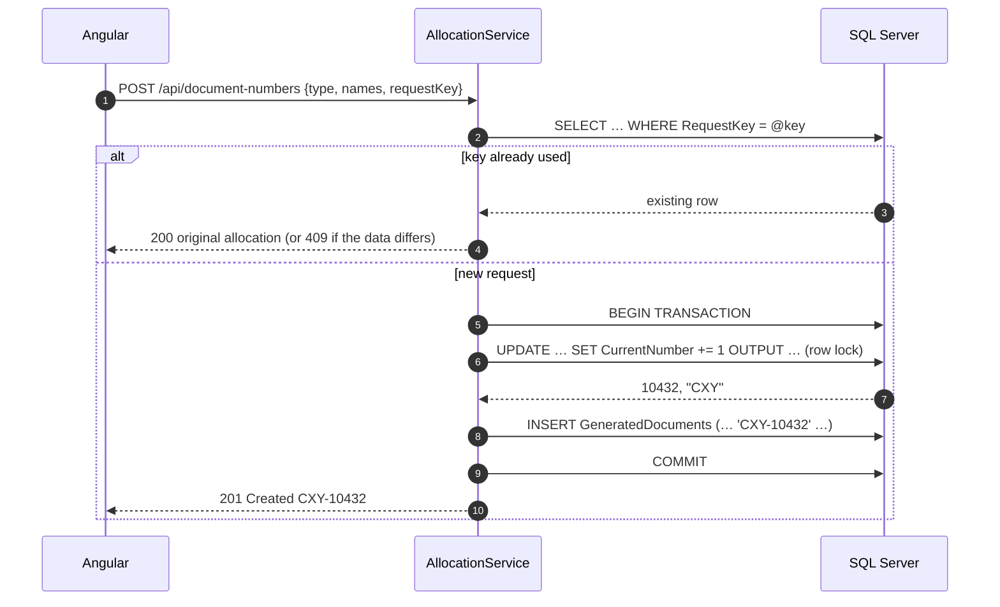
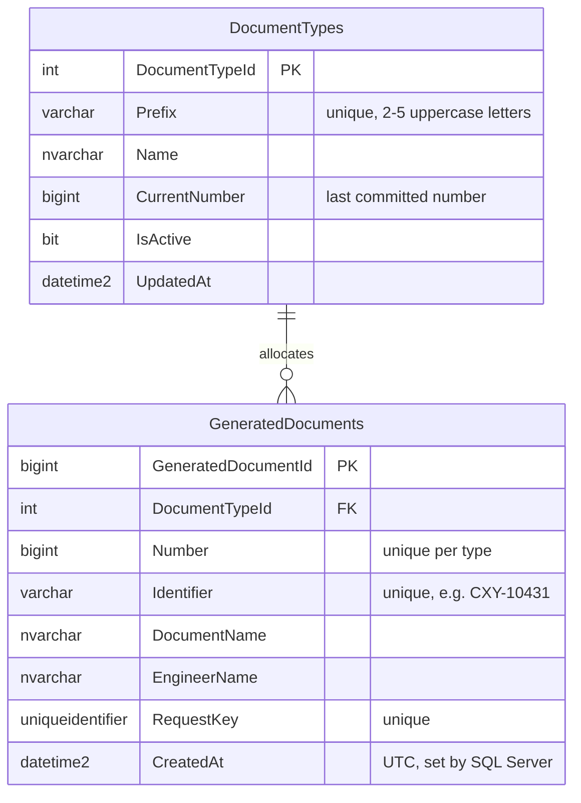

# DocSequence

**Engineering Document Number Management System**: a concurrency-safe service that gives every engineering document a unique, sequential, human-readable identifier such as `CXY-10431`.

> ASP.NET Core 10 · Entity Framework Core 10 · SQL Server · Angular 21 · Tailwind CSS 4 · xUnit · Testcontainers · Vitest

This repository contains the **backend API and its tests**. The Angular frontend lives in the companion repository **DocSequence-Client**.

---

## Contents

- [The problem](#the-problem)
- [User story](#user-story)
- [A day with DocSequence](#a-day-with-docsequence)
- [Features](#features)
- [Architecture](#architecture)
- [How a number is allocated](#how-a-number-is-allocated)
- [Retry safety (idempotency)](#retry-safety-idempotency)
- [API reference](#api-reference)
- [Data model](#data-model)
- [Error handling](#error-handling)
- [Getting started](#getting-started)
- [Testing](#testing)
- [Project structure](#project-structure)
- [Design decisions](#design-decisions)
- [Requirements](#requirements)
- [Roadmap](#roadmap)

---

## The problem

In a manufacturing company, every engineering drawing or document needs an identifier before it can be released: a **type prefix** plus a **sequential number**, for example `CXY-10429` for a CXY drawing.

For years this was done with a **paper ledger**. An engineer finished a drawing, opened the ledger for that document type, wrote down their name and the document, and took the next number. It worked because only one person could hold the ledger at a time.

Moving this to software introduces a problem the ledger never had: **two engineers can ask for a number at the same moment**. A naive implementation that reads the highest number and adds one will hand both of them the same identifier, and two different drawings end up with the same ID on the shop floor.

DocSequence replaces the ledger with a small web application whose central guarantee is simple:

> **Within a document type, a number is issued exactly once, in sequence, no matter how many people ask at the same time.**

---

## User story

### Primary story

> **As an engineer**, I want to select the type of engineering document I am creating and request the next available document number,
> **so that** I can uniquely identify my document without checking a shared ledger or risking a duplicate when another engineer generates one at the same time.

### Supporting stories

| ID | As a… | I want… | So that… |
|---|---|---|---|
| US-001 | Engineer | to generate the next number for a selected document type | my document receives a valid identifier |
| US-002 | Engineer | simultaneous same-type requests to stay duplicate-free | I can trust the identifier I was given |
| US-003 | Engineer | a retry of the same request to return my original number | a dropped network response does not consume a second number |
| US-004 | Engineer | clear validation and failure messages | I always know whether a number was actually allocated |
| US-005 | Maintainer | each document type to keep its own independent sequence | one type never affects another |
| US-006 | Maintainer / support | read-only history with filters | any allocation can be traced to a document, engineer and time |
| US-007 | Manufacturing staff | stable, recognizable identifiers | I can reference the intended engineering document |

### Acceptance flow for the primary story

- **Given** a valid engineer name, document name and active document type, **when** the engineer clicks *Generate*, **then** the next number for **that type only** is allocated.
- The identifier uses the type's prefix and at least four digits, e.g. `CXY-0001` or `CXY-10429`.
- The allocation is saved **before** success is shown.
- Overlapping requests for the same type receive **distinct, consecutive** numbers, with no duplicates and no gaps.
- Retrying the same logical request returns the **original** allocation instead of a new one.

---

## A day with DocSequence

**09:00.** Ada finishes a pump housing drawing. She opens DocSequence, types her name and *"Pump housing drawing"*, picks **CXY · CXY Drawing** and clicks **Generate**. The button shows a spinner, then **`CXY-10431`** appears in large type. She clicks **Copy** and pastes it into the title block of her CAD file.

**09:00, the same second.** Ben, two desks away, also generates a CXY number. He gets **`CXY-10432`**. Their requests reached the server at the same moment, but the database handed out the numbers one at a time, so there's no clash and no gap.

**09:05.** Chen generates a **PXY** valve drawing and gets **`PXY-10429`**. PXY has its own sequence, so CXY's activity doesn't affect it.

**10:30.** Ada's Wi-Fi drops just as she clicks Generate. The server has already saved her number, but the response never reaches her browser, and the page says *"Generation was not confirmed"*. She clicks **Generate** again. Behind the scenes the page re-sends the **same request key**, so the server recognizes the retry and returns her **original** number. No number is wasted.

**14:00.** Someone on the shop floor asks who issued `CXY-10432`. A support engineer opens **History**, types `cxy-10432` and sees Ben's name, the document name and the exact time.

---

## Features

### Engineer-facing (frontend)

- **Generate page**: engineer name, document name and a type dropdown loaded from the API; a large, copyable result; toast notifications
- **History page**: filter by type, identifier, engineer and date range; paged results, newest first
- **Retry-safe**: each logical submission carries a request key that is reused on retry and replaced after success or edit
- **Clear failures**: validation messages per field, and *"Generation was not confirmed"* with the server's reason
- **Local times** on screen, with the stored UTC value in a tooltip

### Platform (backend)

- **Atomic per-type allocation** with a single `UPDATE … OUTPUT` inside a transaction
- **Database-enforced integrity**: unique `(DocumentTypeId, Number)`, unique `RequestKey`, and a prefix `CHECK` constraint
- **Idempotent POST**: replay returns `200` with the original allocation; same key with different data returns `409`
- **Consistent errors**: RFC 9457 ProblemDetails for every 4xx/5xx, `503` when the database is unreachable
- **Correlation IDs**: `X-Correlation-ID` on every response, in error bodies and in log scopes
- **Configurable rate limiting** on generation only
- **Health endpoint** at `/health` (checks database connectivity)

---

## Architecture



| Layer | Technology | Responsibility |
|---|---|---|
| Web UI | Angular 21, TypeScript, Tailwind CSS 4 | Forms, request-key handling, result display, history |
| API | ASP.NET Core 10 controllers | HTTP contract, validation, status codes, ProblemDetails |
| Services | C# `AllocationService`, `HistoryService` | Allocation use case, idempotency, formatting, queries |
| Data access | EF Core 10 + one targeted SQL statement | Mapping, migrations, atomic counter increment |
| Database | SQL Server (LocalDB locally, Azure SQL in the cloud) | Source of truth for counters, allocations and constraints |

**Local development:** the Angular dev server proxies `/api` to `http://localhost:5294`, so no CORS is needed. In production the frontend calls the API directly, and the API's CORS policy allows the frontend's origin, which is set in configuration.

---

## How a number is allocated

The whole concurrency guarantee rests on one statement, executed inside the same transaction as the insert:

```sql
UPDATE DocumentTypes
SET    CurrentNumber = CurrentNumber + 1, UpdatedAt = SYSUTCDATETIME()
OUTPUT inserted.CurrentNumber, inserted.Prefix
WHERE  DocumentTypeId = @DocumentTypeId AND IsActive = 1;
```



**Why this is safe:**

1. **Read and increment happen in one statement.** There's no gap between "read the current number" and "write the next one" for another request to slip into.
2. **The row lock serializes same-type requests.** A second CXY request waits for the first transaction to commit, then increments the *latest committed* value. A PXY request locks a different row and doesn't wait.
3. **Increment and insert commit or roll back together.** If the insert fails, the counter increment is undone, so a failed request never consumes a number.
4. **The database has the final word.** A unique index on `(DocumentTypeId, Number)` makes a duplicate impossible even if application code were wrong.
5. **It works across multiple API instances**, because the counter lives in the database, not in memory.

The test suite proves this with **100 simultaneous requests**, which receive exactly `start+1 … start+100`.

---

## Retry safety (idempotency)

A request can succeed on the server while its response is lost on the way back. Without protection, the user retries and gets a **second** number.

DocSequence prevents that with a client-generated **`requestKey`** (a UUID):

| Situation | Frontend | Backend |
|---|---|---|
| New submission | Creates a new key | Allocates; returns `201` |
| Retry after a failure (form unchanged) | **Re-sends the same key** | Finds the committed row; returns `200` with the **original** allocation |
| User edits the form, or after a success | Creates a new key | Treated as a new request |
| Same key, different data | (does not happen normally) | `409 Conflict`; nothing allocated |
| Two requests with one key at the same moment | | `UNIQUE(RequestKey)` lets exactly one insert win; the other rolls back (including its counter increment), reloads the winner and returns it |

"Same data" means the same document type plus the same document and engineer names after trimming, compared exactly (case-sensitive).

---

## API reference

| Method | Endpoint | Purpose | Success |
|---|---|---|---|
| `GET` | `/api/document-types` | Active document types for the dropdown | `200` |
| `POST` | `/api/document-numbers` | Allocate the next number, or replay a retried request | `201` new · `200` replay |
| `GET` | `/api/document-numbers` | Paged, filterable history | `200` |
| `GET` | `/api/document-numbers/{id}` | One allocation | `200` · `404` |
| `GET` | `/health` | Application and database health | `200 Healthy` · `503 Unhealthy` |

### Allocate a number

```http
POST /api/document-numbers
Content-Type: application/json

{
  "documentTypeId": 1,
  "documentName": "Pump housing drawing",
  "engineerName": "Ada Lovelace",
  "requestKey": "3f2a5c1e-8b7d-4e2f-9a61-0c4d2b7e9f10"
}
```

```http
HTTP/1.1 201 Created
Location: /api/document-numbers/42
X-Correlation-ID: 58fff38a823f4f2d939ac0cb76e2abd3

{
  "allocationId": 42,
  "documentTypeId": 1,
  "prefix": "CXY",
  "number": 10431,
  "generatedIdentifier": "CXY-10431",
  "documentName": "Pump housing drawing",
  "engineerName": "Ada Lovelace",
  "requestKey": "3f2a5c1e-8b7d-4e2f-9a61-0c4d2b7e9f10",
  "createdAt": "2026-10-01T13:00:00.0000000Z"
}
```

| Field | Rule |
|---|---|
| `documentTypeId` | Required; must be an active type |
| `documentName` | Required; 1–200 characters after trimming |
| `engineerName` | Required; 1–100 characters after trimming (self-reported in v1) |
| `requestKey` | Required non-empty UUID; reuse it when retrying the same submission |

### History query

`GET /api/document-numbers?documentTypeId=1&engineer=ada&identifier=cxy-104&from=2026-10-01T00:00:00Z&to=2026-10-01T23:59:59Z&page=1&pageSize=20`

| Parameter | Rule |
|---|---|
| `documentTypeId` | Optional; exact match |
| `engineer` | Optional; case-insensitive "contains" |
| `identifier` | Optional; case-insensitive "contains", e.g. `cxy-104` matches `CXY-10431` |
| `from`, `to` | Optional ISO-8601 timestamps, inclusive; values without an offset are treated as UTC; `from` after `to` gives `400` |
| `page` | Default 1, minimum 1 |
| `pageSize` | Default 20, range 1–100 |

Response: `{ "items": [...], "page": 1, "pageSize": 20, "totalCount": 8, "totalPages": 1 }`, ordered newest first.

### Trying it by hand

[`DocSequence.Api/DocSequence.Api.http`](DocSequence.Api/DocSequence.Api.http) contains ready-made requests for every scenario: create, replay, conflict, unknown type and validation. Open it in Visual Studio or in VS Code with the REST Client extension.

---

## Data model



| Constraint | Enforces |
|---|---|
| `UX_GeneratedDocuments_DocumentTypeId_Number` | A number is never issued twice within a type |
| `UX_GeneratedDocuments_RequestKey` | One allocation per logical request |
| `UX_GeneratedDocuments_Identifier` | Formatted identifiers are unique |
| `UX_DocumentTypes_Prefix` | Prefixes are unique (case-insensitive) |
| `CK_DocumentTypes_Prefix` | Prefix is 2–5 **uppercase** ASCII letters (evaluated under a binary collation) |
| `CK_DocumentTypes_CurrentNumber` | Counter is never negative |

Seed data: **CXY** and **PXY**, both starting at `10428`, matching the examples in the requirements.

---

## Error handling

Every error is an [RFC 9457](https://www.rfc-editor.org/rfc/rfc9457) ProblemDetails body with a `correlationId`, and no error ever returns an identifier.

| Status | When |
|---|---|
| `400` | Missing, blank or overlong fields; invalid history query |
| `404` | Unknown or inactive document type; unknown allocation id |
| `409` | Request key already used with different data |
| `429` | Generation rate limit exceeded |
| `500` | Unexpected failure, including an "impossible" business-number collision |
| `503` | Database unreachable; safe to retry with the same request key |

```json
{
  "title": "Service temporarily unavailable",
  "status": 503,
  "detail": "The database could not be reached. No number was allocated; retry with the same requestKey.",
  "correlationId": "my-test-123"
}
```

Send your own `X-Correlation-ID` header and it is echoed back in the response header, the error body and the server logs, so a user's error report can be matched to the exact log lines.

---

## Getting started

### Prerequisites

| Tool | Version | Used for |
|---|---|---|
| .NET SDK | 10.0 | API and tests |
| SQL Server LocalDB | any recent | Local development database (installed with Visual Studio) |
| Docker Desktop | running | Integration tests (throwaway SQL Server container) |
| Node.js + Angular CLI | Node 24, Angular CLI 21 | Frontend (DocSequence-Client) |

### 1. Run the API

```bash
git clone <this-repo-url> DocSequence
cd DocSequence
dotnet tool install --global dotnet-ef
dotnet ef database update -p DocSequence.Api
dotnet run --project DocSequence.Api --launch-profile http
```

The API listens on **http://localhost:5294**. Check it with:

```bash
curl http://localhost:5294/api/document-types
curl http://localhost:5294/health
```

`dotnet ef database update` creates the `DocSequence` database on `(localdb)\MSSQLLocalDB` and seeds CXY and PXY. The connection string is in `DocSequence.Api/appsettings.Development.json`.

### 2. Run the frontend

In the **DocSequence-Client** repository:

```bash
npm install
npm start
```

Open **http://localhost:4200**. `npm start` uses `proxy.conf.json` to forward `/api` to the API on port 5294.

### Configuration

| Setting | Default | Notes |
|---|---|---|
| `ConnectionStrings:Default` | LocalDB (Development) | Set through App Service configuration in the cloud; never committed |
| `RateLimiting:Enabled` / `PermitLimit` / `WindowSeconds` | `true` / `10` / `60` | Fixed window per client IP; applies to `POST /api/document-numbers` only |
| `Cors:AllowedOrigins` | `[]` | Add the deployed frontend URL; not needed locally |

### Troubleshooting

| Symptom | Fix |
|---|---|
| `LocalDB instance startup … process failed to start` | `sqllocaldb stop MSSQLLocalDB` then `sqllocaldb start MSSQLLocalDB`, and restart the API |
| `Failed to bind to address … 5294: address already in use` | Another copy of the API is running; stop it (Task Manager → `DocSequence.Api.exe`) |
| Frontend requests hang | The API may be paused in the debugger; run it with **Ctrl+F5** while working on the UI |

---

## Testing

```bash
dotnet test            # backend: 42 tests, needs Docker running
```

```bash
npx ng test --watch=false   # frontend (DocSequence-Client): 6 tests
```

The backend tests start a **real SQL Server 2022 container** through Testcontainers, apply the EF Core migrations, and drive the API over HTTP with `WebApplicationFactory`. An in-memory database would not reproduce SQL Server's locking, rollback, collation or constraint behaviour, which are exactly what the concurrency guarantees depend on.

### Acceptance criteria → tests

| Requirement | Test |
|---|---|
| AC-001 Basic generation | `AllocationApiTests.Allocate_returns_201_with_next_number_and_location` |
| AC-002 Independent sequences | `AllocationApiTests.Each_type_advances_only_its_own_sequence` |
| AC-003 Duplicate prevention | `DatabaseConstraintTests.Duplicate_type_and_number_is_rejected` |
| **AC-004 100 parallel requests** | **`ConcurrencyTests.Hundred_parallel_same_type_requests_get_distinct_contiguous_numbers`** |
| AC-006 Unknown type | `AllocationApiTests.Unknown_type_returns_404_and_changes_no_sequence` |
| AC-007 Validation | `AllocationApiTests.Blank_names_return_400_without_allocating`, `Overlong_document_name_returns_400`, `Empty_request_key_returns_400` |
| AC-009 / AC-010 History and filtering | `HistoryApiTests.*` (engineer, type, identifier, paging) |
| AC-011 Idempotent replay | `AllocationApiTests.Retry_with_same_key_and_equivalent_body_replays_original` |
| AC-012 Key conflict | `AllocationApiTests.Same_key_with_different_body_returns_409_without_allocating` |
| AC-013 Database unavailable | `DatabaseUnavailableTests.Allocation_returns_503_problem_details_without_an_identifier` |
| AC-014 Formatting | `IdentifierFormatterTests.Pads_to_four_digits_and_never_truncates` |
| AC-015 Rollback | `FailureHandlingTests.Failure_after_counter_update_rolls_back_and_consumes_no_number` |
| **AC-017 Same-key race** | **`ConcurrencyTests.Parallel_requests_with_one_key_produce_exactly_one_allocation`** |
| AC-018 ProblemDetails + correlation | `OperationalTests.Supplied_correlation_id_is_echoed_in_header_and_problem_details`, `Correlation_id_is_generated_when_missing_and_matches_the_body` |
| AC-019 Prefix rule in the database | `DatabaseConstraintTests.Prefix_check_rejects_invalid_prefixes` |
| AC-020 Configurable rate limit | `OperationalTests.Generation_is_rate_limited_when_enabled_but_reads_and_health_are_not` |
| AC-022 Constraint-specific mapping | `FailureHandlingTests.Business_number_collision_returns_500_and_rolls_back` |
| AC-023 Date filter rules | `HistoryApiTests.Offsetless_dates_are_treated_as_utc`, `Invalid_query_returns_400` |
| Frontend: request-key reuse, pending state, errors | `generate-form.spec.ts` (DocSequence-Client) |

---

## Project structure

```
DocSequence/
├── docs/
│   └── DocSequence_..._SRS_v1.3.pdf     Requirements specification
├── DocSequence.Api/
│   ├── Contracts/        Request/response records (API shapes)
│   ├── Controllers/      DocumentNumbers, DocumentTypes
│   ├── Data/             AppDbContext (constraints, seed), Migrations/
│   ├── Entities/         DocumentType, GeneratedDocument
│   ├── Infrastructure/   CorrelationIdMiddleware, ApiExceptionHandler, RateLimitSettings
│   ├── Services/         AllocationService, HistoryService, IdentifierFormatter
│   ├── Validation/       TrimmedLength, NotEmptyGuid attributes
│   ├── Program.cs        Composition root and middleware pipeline
│   └── DocSequence.Api.http   Manual test requests
├── DocSequence.Tests/
│   ├── Infrastructure/   Testcontainers factory, shared fixtures, helpers
│   └── *Tests.cs         Allocation, concurrency, history, constraints, failures, operations
└── DocSequence.slnx
```

---

## Design decisions

| Decision | Alternatives considered | Why |
|---|---|---|
| **Atomic `UPDATE … OUTPUT` on a per-type counter row** | `MAX(Number)+1`; SQL `SEQUENCE` per type; optimistic concurrency with retries; `SERIALIZABLE` | One statement, no read-then-write gap, no retries, no gaps. `MAX+1` races; sequences need DDL for each new type and skip numbers on rollback; optimistic retries get slow under contention. |
| **Not `IDENTITY` for the business number** | `IDENTITY` column | `IDENTITY` is global, not per type, and leaves gaps whenever an insert fails. It's still used for the internal row key. |
| **Database constraints as the final safeguard** | Rely on application code | Even a bug in the service cannot produce a duplicate. |
| **Client-generated request key + `UNIQUE(RequestKey)`** | Server-side de-duplication by content | Handles the lost-response case and true races; the pre-check is the fast path, the constraint settles races. |
| **Unique violations mapped by constraint name** | Treat every unique violation the same | A `RequestKey` collision is a retry race (`200`/`409`); a number collision is a defect (`500`). |
| **Prefix `CHECK` under `Latin1_General_BIN2`** | Default collation | The default collation is case-insensitive, so `[A-Z]` would also accept lowercase. |
| **Stored, formatted `Identifier` column** | Format on every query | History search can match `CXY-0042` directly; allocations are immutable, so it never goes stale. |
| **UTC set by SQL Server (`SYSUTCDATETIME()`)** | Application server clock | One clock for every API instance; the UI converts to local time. |
| **Real SQL Server in tests (Testcontainers)** | EF Core InMemory | InMemory has no locking, transactions or constraints, so it can't prove the guarantees. |
| **Separate frontend repository** | Single repository | Independent deployment (Static Web Apps + App Service); the API exposes a CORS policy for the frontend's origin. |
| **HTTPS redirection outside Development only** | Always redirect | Locally the Angular proxy talks plain http; redirecting would bounce proxied calls to another port. |

---

## Requirements

The full specification, with business rules, functional and non-functional requirements, API contract, acceptance criteria and traceability matrix, is in [`docs/`](docs/) (**SRS v1.3**).

Version 1 deliberately has **no authentication**: the engineer name is self-reported and stored as display/audit data. Organizational SSO is the planned next step.

---

## Roadmap

- [x] Atomic per-type allocation with idempotent retries
- [x] Read APIs with filtering and paging
- [x] Angular frontend: Generate and History pages
- [x] Hardening: ProblemDetails, 503, correlation IDs, rate limiting, health, CORS
- [x] 42 backend and 6 frontend automated tests
- [ ] CI with GitHub Actions
- [ ] Deployment: Azure SQL, App Service, Static Web Apps
- [ ] Organizational SSO (engineer identity from claims)
- [ ] Document-type administration UI
- [ ] Voiding and bulk reservation workflows

---

*DocSequence is an independent portfolio project based on an interview exercise. It does not describe any company's production system.*
